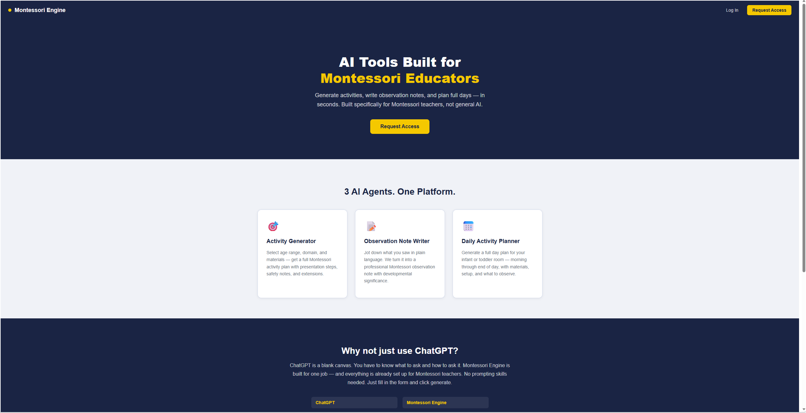
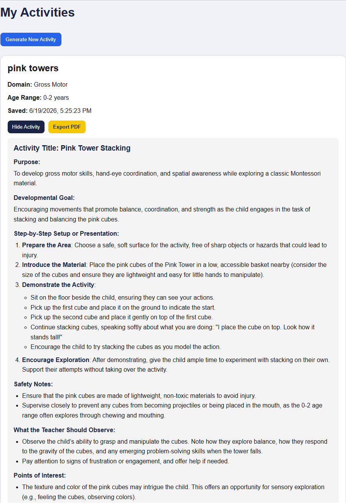
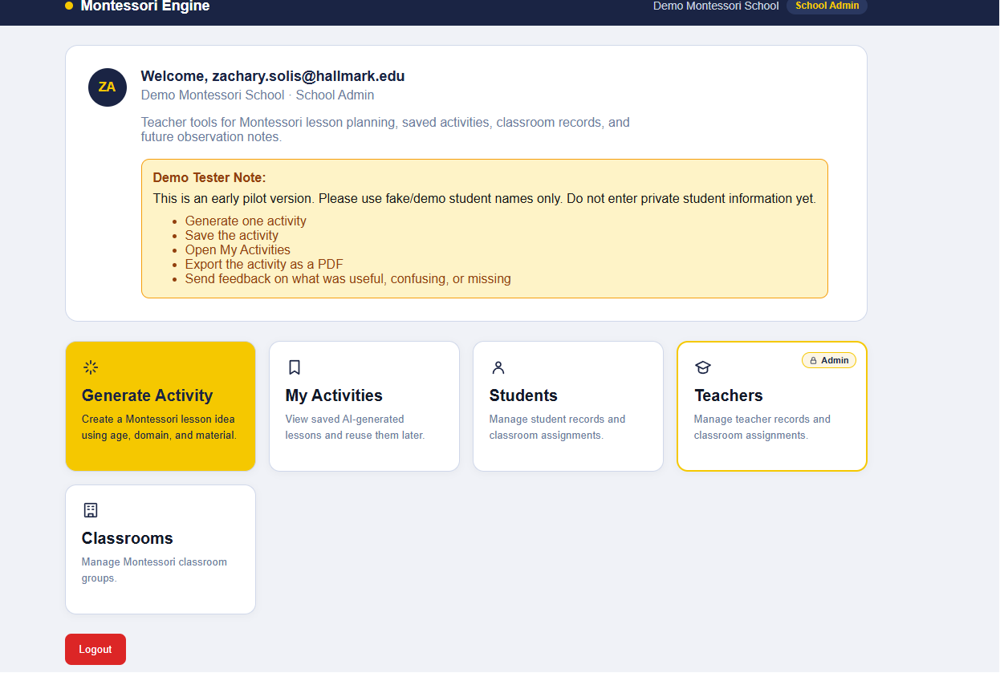

# Montessori Engine 🎯

AI-powered tools built specifically for Montessori educators. Generate activities, write observation notes, and plan full days — in seconds.

**Live:** https://montessori-engine.vercel.app

---

## What It Does

Montessori Engine gives teachers 3 AI agents in one platform. No prompting skills needed — just fill in a form and click generate.

### 🎯 Activity Generator
Select age range, domain, and materials — get a full Montessori activity plan with presentation steps, safety notes, points of interest, and extensions.

### 📝 Observation Note Writer
Jot down what you saw in plain language. The AI turns it into a professional Montessori observation note with developmental significance and follow-up suggestions.

### 📅 Daily Activity Planner
Generate a full day plan for any Montessori classroom — infant through Elementary — morning through end of day, with materials, setup, and what to observe.

---

## Dashboard

---

## Tech Stack

| Layer | Technology |
|---|---|
| Frontend | Next.js 16, TypeScript, React |
| Backend | Supabase (Auth, Database, Edge Functions) |
| AI | OpenAI GPT-4o-mini |
| Deployment | Vercel |
| Styling | Inline styles with custom theme |

---

## Features

- ✅ 3 AI agents built for Montessori educators
- ✅ Supabase authentication and user profiles
- ✅ Activity library — save and revisit generated activities
- ✅ School-based data model (multi-school support)
- ✅ Mobile responsive navigation
- ✅ Export activities to PDF
- ✅ Copy to clipboard for observation notes and day plans
- ✅ Deployed on Vercel with Supabase edge functions

---

## Age Groups Supported

- Infant (0–12 months)
- Young Toddler (12–24 months)
- Older Toddler (24–36 months)
- Mixed Infant/Toddler (0–36 months)
- Primary (3–6)
- Lower Elementary (6–9)

---

## Built By

Zachary Solis — Student at Hallmark University, San Antonio TX  

📧 zach.solis@icloud.com  
🔗 https://montessori-engine.vercel.app