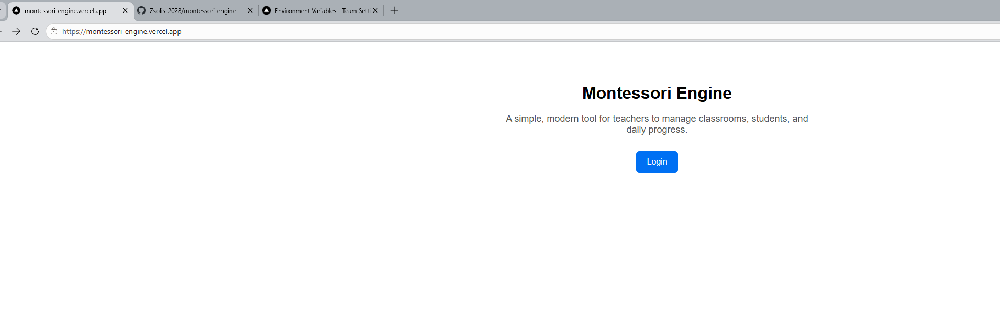
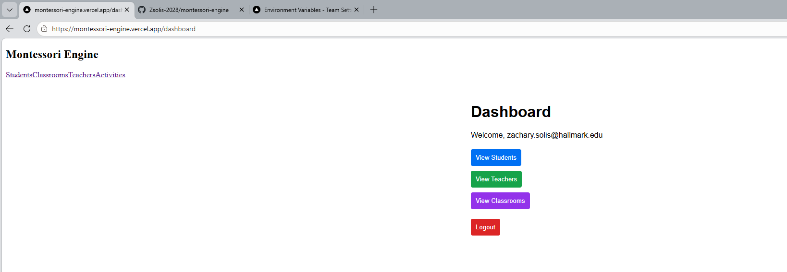
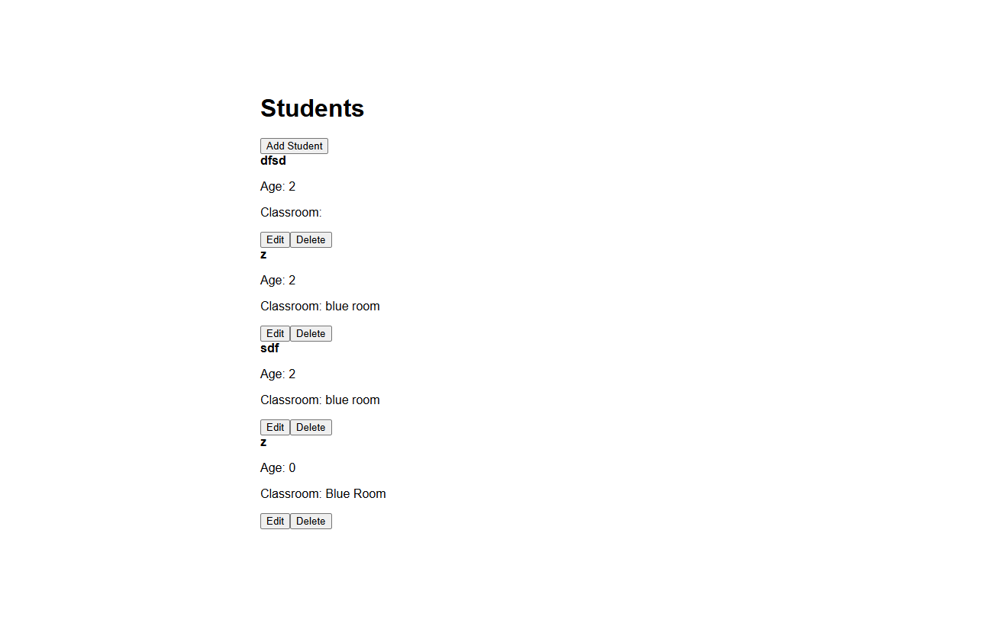
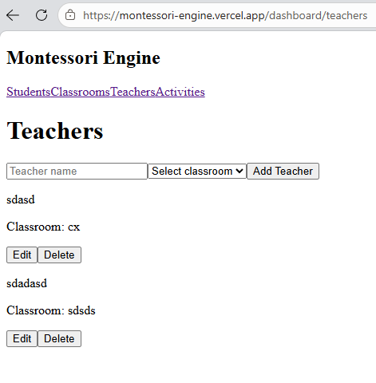
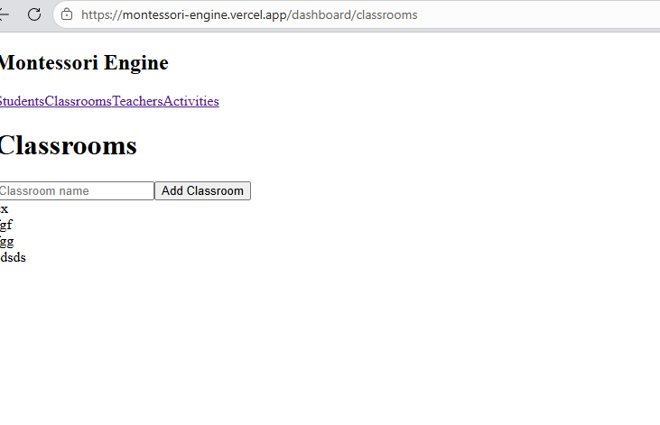

# Montessori Engine

Montessori Engine is a full-stack school management application built with Next.js, Supabase, and Vercel.

The goal is to help Montessori schools manage students, teachers, classrooms, daily operations, and future AI-powered activity generation.

## Live Demo

https://montessori-engine.vercel.app

## Tech Stack

- Next.js 16 App Router
- TypeScript
- Tailwind CSS
- Supabase Auth
- Supabase Postgres
- Supabase Row Level Security
- Vercel Deployment

## Current Features

### Authentication
- Email/password login
- Protected dashboard routes
- Logout flow

### Dashboard
- Logged-in user dashboard
- Navigation to students, teachers, and classrooms

### Student Management
- View students
- Add students
- Edit students
- Delete students

### Teacher Management
- View teachers
- Add teachers
- Edit teachers
- Delete teachers
- Assign teachers to classrooms

### Classroom Management
- View classrooms
- Add classrooms

## Security Focus

This project is being built with security in mind, including:

- Supabase authentication
- Environment variables for secrets
- Protected routes
- Database access control
- Planned Row Level Security improvements
- Future role-based access for admins, teachers, and parents

## Roadmap

- Improve activity generator
- Add parent portal
- Add admin tools
- Improve role-based access control
- Add progress tracking
- Add attendance tracking
- Add reporting dashboard
- Add security review notes

## Project Purpose

This project is part of my cloud computing and security learning path. I am using it to practice full-stack development, authentication, database design, deployment, and secure application architecture.

## Features

- Supabase Authentication
- Student Management
- Teacher Management
- Classroom Management
- Next.js App Router
- Vercel Deployment

## Architecture

Next.js
↓
Supabase Auth
↓
Supabase Database
↓
Vercel Hosting

## Future Roadmap

- Attendance Tracking
- Activity Generator
- Parent Portal
- Teacher Dashboard
- Security Hardening
## Screenshots

### Login

### Dashboard

### Students

### Teachers

### Classrooms

